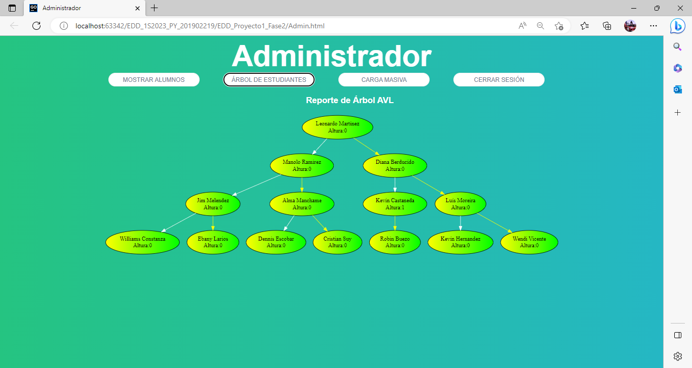
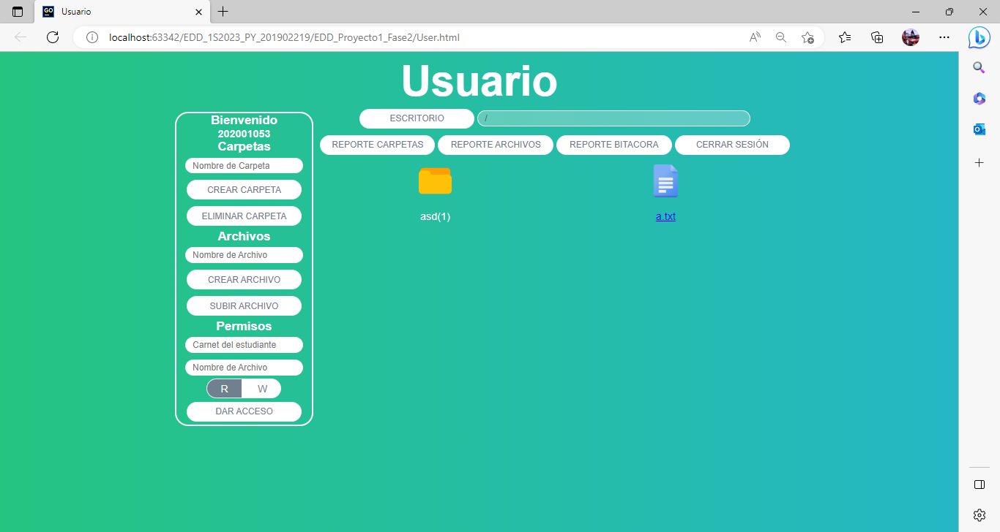
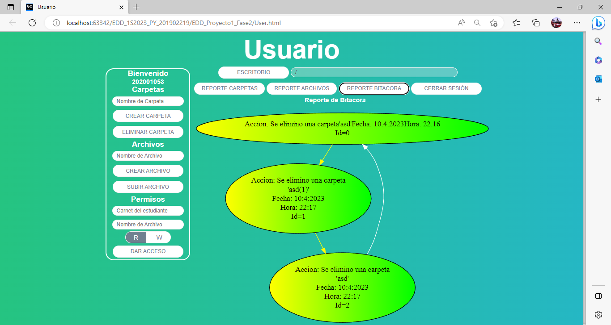
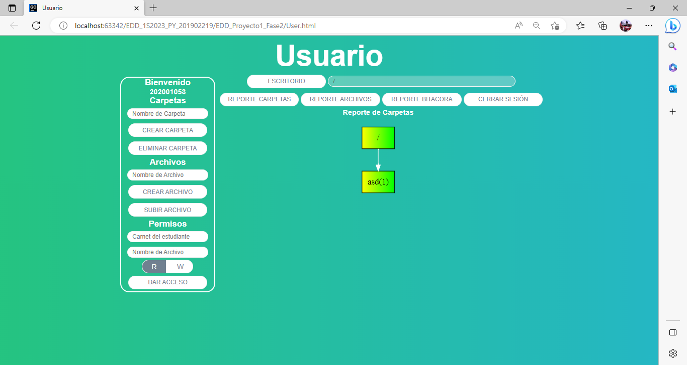
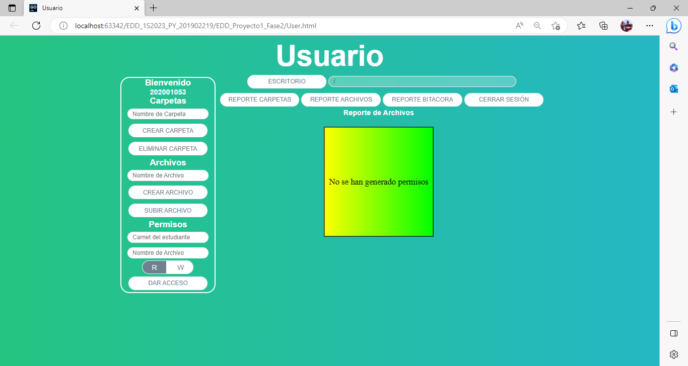

# Manual de Usuario
## Ventana principal

En esta ventana el usuario así como el administrador podran inciar sesion, solo se piden dos parametros los cuales son la contraseña y el nombre de usuario.
## Ventana administrador

En esta ventana se podra realizar cargas masivas de archivos JSON donde se mostrara la informacion cargada en un tabla en la cual se le podra dar diferentes tipos de ordenamiento.
### Ventana administrador - Arbol de estudiantes

En esta ventana el administrador podra ver el Arbol de los alumnos cargados al sistema.
## Ventana usuario

Esta ventana sera la pantalla de inico del usuario, donde tendra un panel a la izquierda en el cual podra efectuar diversas tareas, como crear o eliminar carpetas, crear o subir archivos y agregar permisos a sus carpetas para otros usuarios.
### Ventana usuario - Reporte de bitacora

En esta ventana el usuario vera sus acciones en una lista circular.
### Ventana usuario - Reporte de carpetas

En esta ventana el usuario vera el arbol que se genera respecto a las carpetas que tenga en su cuenta.
### Ventana usuario - Reporte de carpetas

En esta ventana el usuario vera la matriz que se genera al dar permisos.

# Manual de Usuario
## Lista Circular
Esta lista circular fue creada para almacenar la bitacora del usuario.
```
class NodoLC {
    constructor(item,id){
        this.item = item;
        this.nextNodeLC = null;
        this.id=id;
    }
}
```
Se creo un NodoLC para la utilizacion de la lista, donde:
```
this.item = item;
```
Sera un objeto que tendra un mensaje en forma de string
```
this.nextNodeLC = null;
```
Es el apuntador hacia el siguiente nodo de la lista.
```
this.id=id;
```
Es el numero correlativo del nodo en su lista.

El constructor de la lista se utlizo un atributo root para la cabeza de la lista y uno llamado last para su nodo final
```
class LC {
    constructor() {
        this.root = null;
        this.last = null;
        this.size=0;
    }
...
```
Se creo un atributo size para almacenar el tamaño de la lista.
```
this.size=0;
```
Para la incercion de datos se utilizo dos metodos, un metodo padre y un hijo.
```
    insert(item){
        this.root=this.#insertRecursive(item,this.root)
    }
    
    #insertRecursive(item, node){
        if(node==null){
            node=new NodoLC(item,this.size)
            this.last=node
        }else {
            let current=node
            while (current.nextNodeLC!=null){
                current=current.nextNodeLC
            }
            current.nextNodeLC=new NodoLC(item,this.size)
            this.last=current.nextNodeLC
        }
        this.size=this.size+1
        return node
    }
```
El metodo padre se encarga de llevar a la raiz de la lista la incercion de los nodos.
```
insert(item){
        this.root=this.#insertRecursive(item,this.root)
    }
```
El primer if del metodo decide que si el siguiente nodo que se ingresara es nulo, se procede a agregar el nuevo nodo.
```
        if(node==null){
            node=new NodoLC(item,this.size)
            this.last=node
        }
```
Si no se cumple la condicion del if se procede a hacer un ciclo while, donde se buscara el nodo final de la lista y se ingresara el nuevo nodo.
```
            let current=node
            while (current.nextNodeLC!=null){
                current=current.nextNodeLC
            }
            current.nextNodeLC=new NodoLC(item,this.size)
            this.last=current.nextNodeLC
```
## Arbol AVL
Este arbol se utilizo para el almacenamiento de usuarios, donde se creo un Nodo de la siguiente manera:
```
class NodoAVL {
    constructor(item){
        this.item = item;
        this.left = null;
        this.right = null;
        this.height = 0;
        this.LC=new LC()
        this.NA=new NA()
        this.SM=new SM()
    }
}
```
Donde su constructor recibe un objeto item con los datos del usuario.
```
this.item = item;
```
Se agregan los nodos hijos del nodo padre junto a su peso.
```
        this.left = null;
        this.right = null;
        this.height = 0;
```
Se agregan las diferentes estructuras que utila nuestro nodo.
```
        this.LC=new LC()
        this.NA=new NA()
        this.SM=new SM()
```
El constructor de la lista solo adiquiere el nodo raiz.
```
class ArbolAVL {
    constructor(){
        this.root = null;
    }
...
```
Para insertar nodos se utiliza dos metodos, uno base y otro con recursividad
```
    insert(item){
        this.root = this.#insertRecursive(item, this.root);
        this.getHeight(this.root)
        this.root=this.checkBalance(this.root)
    }
    #insertRecursive(item, node){
        if(node==null){
            node=new NodoAVL(item)
        }else if(item.id<node.item.id){
            //left
            node.left=this.#insertRecursive(item,node.left)

        }else if(item.id>node.item.id){
            //right
            node.right=this.#insertRecursive(item,node.right)
        }
        return node
    }
```
El metodo recursivo es el que se encarga de ingresar los nodos
```
if(node==null){
            node=new NodoAVL(item)
}
```
si el nodo es nulo lo agrega.
```
else if(item.id<node.item.id){
            //left
            node.left=this.#insertRecursive(item,node.left)

        }
```
si el id del nodo es menor que el id que tiene la cabeza, va hacia la izquierda.
```
else if(item.id>node.item.id){
            //right
            node.right=this.#insertRecursive(item,node.right)
        }
```
si el id del nodo es mayor que el id que tiene la cabeza, va hacia la derecha.

En el metodo de insert tambien se tiene los metodos para obtener su altura y balancear el arbol.
```
        this.root = this.#insertRecursive(item, this.root);
        this.getHeight(this.root)
        this.root=this.checkBalance(this.root)
```
El metodo para obtener las alturas recorre todo el arbol por todos sus nodos para obtener las alturas por la izquierda y por la derecha de todos los nodos.
```
getHeight(node){
        node.height=0
        var heightRight=0
        var heightLeft=0
        if(node.left){
            heightLeft-=this.getHeight(node.left)
        }
        if(node.right){
            heightRight+=this.getHeight(node.right)
        }
        node.height=heightRight+heightLeft

        return Math.max(heightRight, Math.abs(heightLeft))+1
    }
    checkBalance(node){
        if(node.left){
            node.left = this.checkBalance(node.left)
        }
        if(node.right){
            node.right=this.checkBalance(node.right)
        }
        this.getHeight(this.root)
        if(node.height>1 || node.height<-1){
            node = this.balancear(node)
            this.getHeight(this.root)
            node=this.checkBalance(node)
        }
        return node
    }
```
Para balancear el arbol se utiliza un metodo que escoge que tipo de rotaciones se deben de realizar.
```
balancear(parent){
        if(parent.height>1 && parent.right && (parent.right.height>1||parent.right.height<-1)){
            parent.right = this.balancear(parent.right)
        }else if(parent.height<-1 && parent.left && (parent.left.height<-1||parent.left.height>1)){
            parent.left = this.balancear(parent.left)
        }else if(parent.height<0 &&parent.left.height===-1){
            if(parent.left.right){
                var saveRight = parent.left.right
            }
            if(parent.left.left){
                var saveLeft =parent.left.left
            }
            parent.left.right = new NodoAVL(parent.item)
            parent.left.right.right=parent.right
            parent =parent.left
            parent.right.left=saveRight
            parent.left =saveLeft
        }else if(parent.height<0 &&parent.left.height===1){
            if(parent.left.right.left){
                var saveLeft = parent.left.right.left
            }if(parent.left.right.right){
                var saveRight = parent.left.right.right
            }
            parent.left.right.right = new NodoAVL(parent.item)
            parent.left.right.right.right = parent.right
            parent.left.right.left = new NodoAVL(parent.left.item)
            parent.left.right.left.left=parent.left.left
            parent =parent.left.right
            parent.left.right = saveLeft
            parent.right.left = saveRight
        }else if(parent.height>0 &&parent.right.height===1){
            if(parent.right.left){
                var saveLeft =parent.right.left
            }if(parent.right.right){
                var saveRight = parent.right.right
            }
            parent.right.left = new NodoAVL(parent.item)
            parent.right.left.left =parent.left
            parent = parent.right
            parent.left.right = saveLeft
            parent.right=saveRight

        }else if(parent.height>0 &&parent.right.height===-1){
            if(parent.right.left.right){
                var saveRight = parent.right.left.right
            }
            if(parent.right.left.left){
                saveLeft=parent.right.left.left
            }
            parent.right.left.left = new NodoAVL(parent.item)
            parent.right.left.right = new NodoAVL(parent.right.item)
            parent.right.left.right.right=parent.right.right
            parent.right.left.left.left = parent.left
            parent =parent.right.left
            parent.right.left = saveRight
            parent.left.right =saveLeft
        }

        return parent
    }
```
## Matriz
su constructor consta de coordenadas, valores en coordenadas y sus direcciones a los siguientes nodos.
```
class Mnode{
    constructor(x, y, value,xValue,yValue){
        this.x = x;
        this.y = y;
        this.xValue = xValue;
        this.yValue = yValue;
        this.value = value;
        this.up = null;
        this.down = null;
        this.right = null;
        this.left = null;
    }
}
```
Su constructor crea su root y tiene como atributos los tamaños de sus cabeceras para facilitar la insercion.
```
    constructor(){
        this.head =  new Mnode(-1, -1, "Inicio");
        this.xSize=0
        this.ySize=0
    }
```
El metodo insert primero crea las cabezas en X y Y y luego agrega el nodo
```
   insert(x, y, value,xValue,yValue){
        let p=this.head
        let q=this.head
        while (p.down!=null){
            if(p.down.xValue==xValue){
                x=p.down.value
            }
            p=p.down
        }
        while (q.right!=null){
            if(q.right.yValue==yValue){
                y=q.right.value
            }
            q=q.right
        }
        this.#xHeaders(x,xValue,yValue);
        this.#yHeaders(y,xValue,yValue);
        const node = new Mnode(x,y,value,xValue,yValue);
        this.#addX(node, x);
        this.#addY(node, y);

    }
```
Para facilitar la incercion se crearon dos metodos de busqueda los cuales encuetran las cabezas y obtienen sus respectivas coordenadas.
```
        let p=this.head
        let q=this.head
        while (p.down!=null){
            if(p.down.xValue==xValue){
                x=p.down.value
            }
            p=p.down
        }
```
En este caso se busca la cabeza en x que tenga el mismo valor, se obtiene su coordenada y se le envia al los metodos de insercion, este procedimiento tambien se hace en Y.

## Arbol n-ario
Consta de dos listas, una para sus archivos y otra para sus carpetas.
```
class nodeNA{

    constructor(folderName){
        this.folderName = folderName;
        this.files = [];
        this.children = [];
        this.id = null;
    }
}
```
Su metodo de insercion solo agrega nodos a su lista dependiendo la ruta a la que pertenesca la carpeta padre y las carpetas hijo
```
insert(folderName, fatherPath){
        let fatherNode = this.getFolder(fatherPath);
        if(fatherNode){
            folderName=this.repeatFolder(folderName,fatherNode)
            let newNode =  new nodeNA(folderName);
            this.size += 1;
            newNode.id = this.size;
            fatherNode.children.push(newNode);
        }else{
            console.log("Ruta no existe");
        }
        return folderName
    }
```
